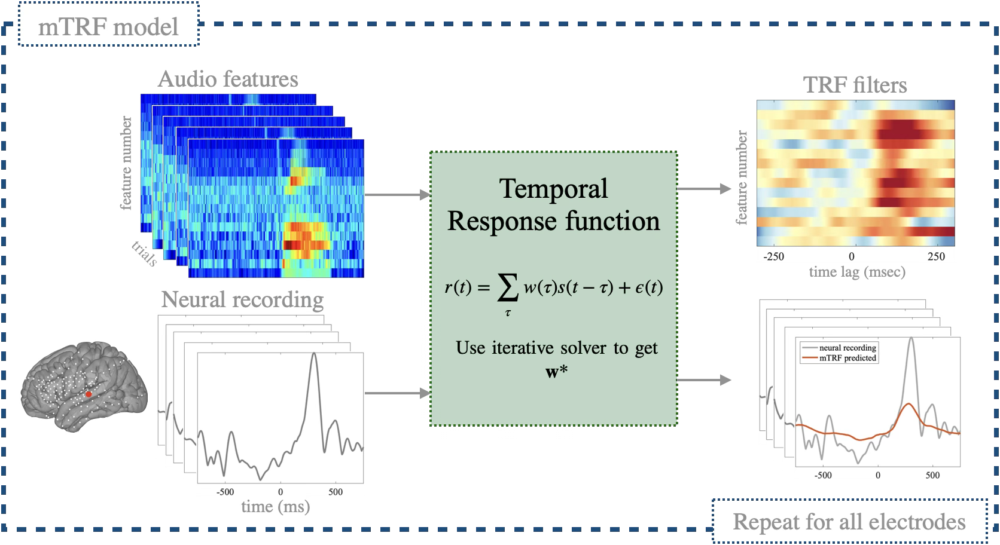
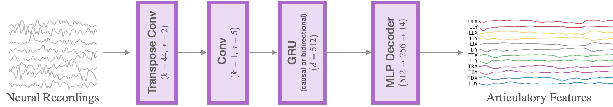

## Neural Dynamics of Automatic Speech Production

This repository provides a pipeline for **neural dynamics of automatic speech production**. We look at ECoG recordings during speech production tasks like counting and reciting name of days and months. The code implements **multivariate temporal response function (mTRF)** model to quantify how audio features map to neural activity (encoding), as well as speech decoding.

---

## Overview

The core goals of this project are:

- **Encoding**: We model the relationship between continuous speech audio and neural responses using regularized mTRF models.

<p align="center">
  
</p>

- **Decoding**: We estimate the articulatory trajectories of [SPARC](https://github.com/Berkeley-Speech-Group/Speech-Articulatory-Coding) from the neural signals, and during evaluation we use the SPARC synthesis module to generate the corresponding audio waveform.

<p align="center">
  
</p>

## Related Projects

This repository builds on and complements the following projects:

- **ADMM-based mTRF solver**:
  [https://github.com/amirhkhalilian/ADMM_mTRF](https://github.com/amirhkhalilian/ADMM_mTRF)
  Sparse and scalable optimization for multivariate temporal response functions.

- **Mithra**:
  [https://github.com/amirhkhalilian/Mithra](https://github.com/amirhkhalilian/Mithra)
  An open-source visualization toolbox for ECoG and sEEG recordings.

---

## Example Usage

Run a single subject–task analysis from the command line:

```bash
python main_permute.py --idx <INDEX>
```

---
## Citation

```bib
@article {Khalilian-Gourtani2026.02.10.705088,
	author = {Khalilian-Gourtani, Amirhossein and Le, Chenqian and Zhou, Faxin and Jenson, Erika and Dugan, Patricia and Devinsky, Orrin and Doyle, Werner and Friedman, Daniel and Wang, Yao and Flinker, Adeen},
	title = {Neural Dynamics of Automatic Speech Production},
	elocation-id = {2026.02.10.705088},
	year = {2026},
	doi = {10.64898/2026.02.10.705088},
	publisher = {Cold Spring Harbor Laboratory},
	URL = {https://www.biorxiv.org/content/early/2026/02/11/2026.02.10.705088},
	eprint = {https://www.biorxiv.org/content/early/2026/02/11/2026.02.10.705088.full.pdf},
	journal = {bioRxiv}
}

```
